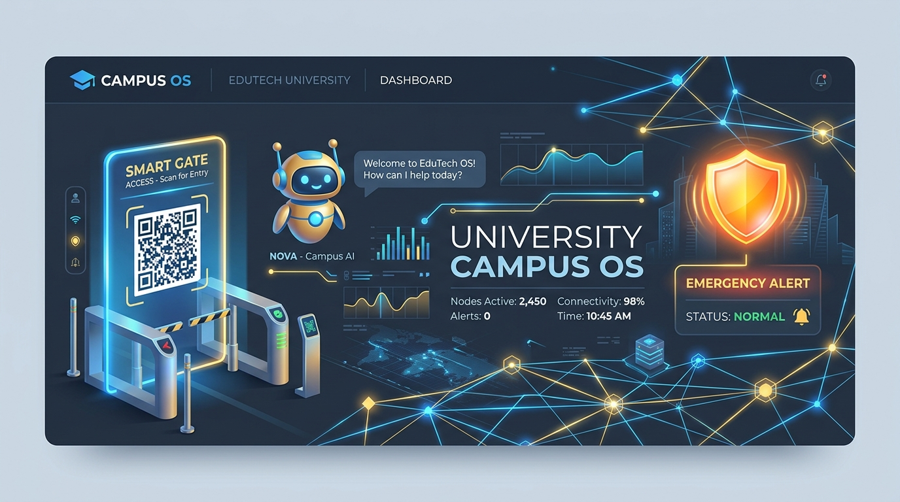
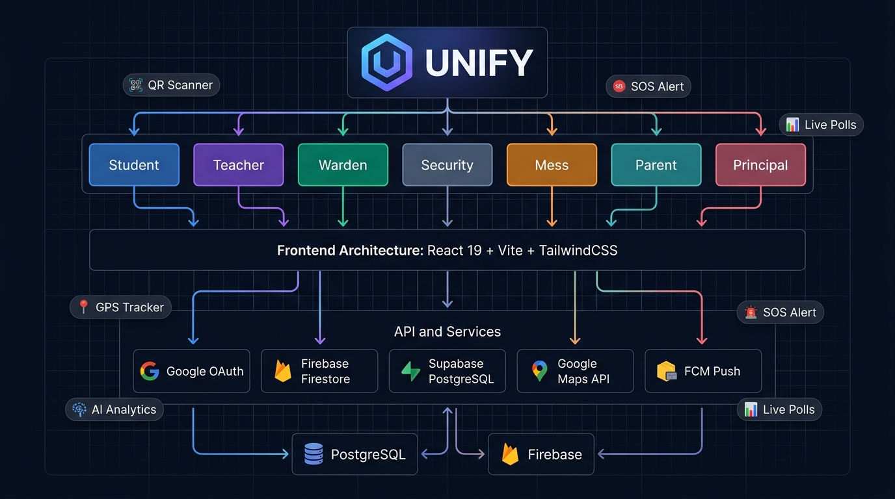
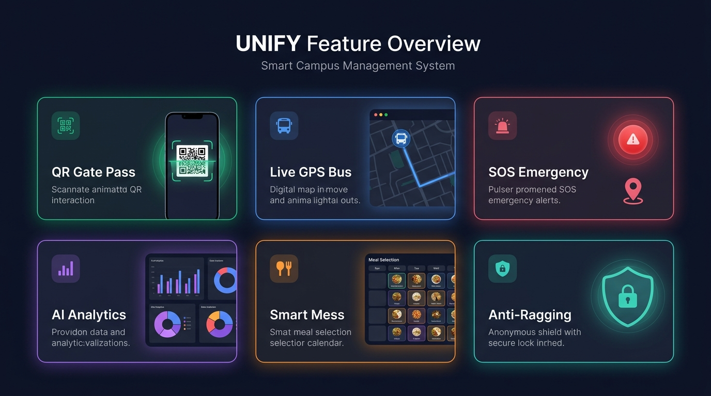
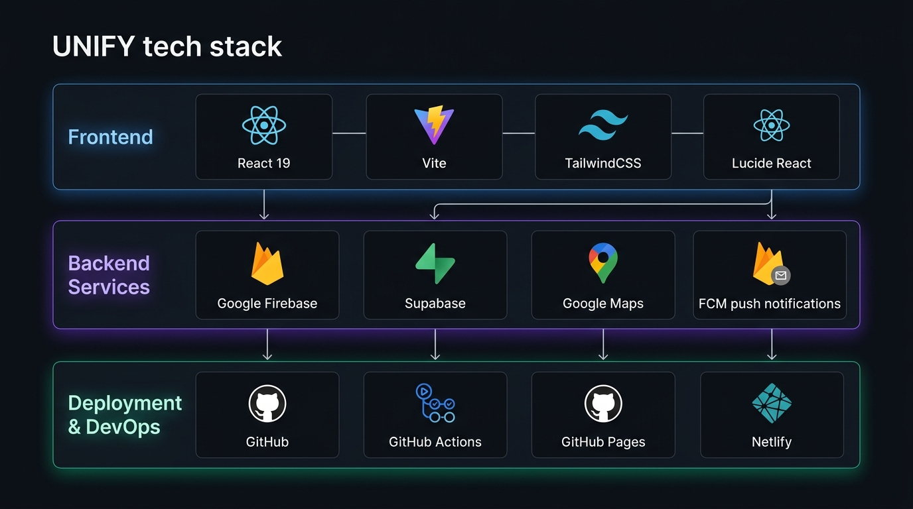

<div align="center">



# 🎓 UNIFY — Smart Campus Management System

**One intelligent platform for every campus role.**  
AI-powered • Real-time • Offline-ready • PWA

[](https://piyush77777777777.github.io/unify-campus-portal/)
[](https://react.dev)
[](https://vitejs.dev)
[](https://tailwindcss.com)
[](https://firebase.google.com)
[](https://supabase.com)
[](LICENSE)

</div>

---

## 🚀 Live Demo

> **[https://piyush77777777777.github.io/unify-campus-portal/](https://piyush77777777777.github.io/unify-campus-portal/)**

No sign-up needed. Click any portal card and use demo credentials.

---

## 🏗️ System Architecture



UNIFY follows a **layered architecture**:

```
┌──────────────────────────────────────────────────────────┐
│               USER PORTALS (7 Roles)                     │
│  Student │ Teacher │ Warden │ Guard │ Mess │ Parent │ Principal │
└──────────────────┬───────────────────────────────────────┘
                   │
┌──────────────────▼───────────────────────────────────────┐
│           REACT FRONTEND  (Vite + TailwindCSS)           │
│   CampusContext (Global State) + React Router (Tabs)     │
└──────┬──────────┬──────────┬─────────────┬───────────────┘
       │          │          │             │
  ┌────▼───┐ ┌───▼────┐ ┌──▼──────┐ ┌───▼────────────┐
  │Firebase│ │Supabase│ │ Google  │ │   Google Maps  │
  │  Auth  │ │  DB    │ │  FCM   │ │   + GPS API    │
  │  FCM   │ │  RLS   │ │  Push  │ │   Geocoding    │
  └────────┘ └────────┘ └─────────┘ └────────────────┘
```

---

## ✨ Feature Overview



### 🎓 Student Portal (14 Features)
| Feature | Description |
|---------|-------------|
| 📊 Attendance Dashboard | QR/NFC tracking with subject-wise breakdown |
| 🚪 Gate Pass (QR) | Digital outgoing/incoming pass — warden verified |
| 💰 Fee Status | Real-time dues, payment reminders |
| 🍽️ Mess Reservation | Pre-select meals for the week |
| 🛏️ Room & Assets | Maintenance logs, asset records |
| 🚨 SOS Button | GPS-tagged emergency → Teacher + Security + Dean |
| 🚫 Anti-Ragging | Anonymous report → Dean with one tap |
| 📅 Academic Progress | Grades, feedback, productivity view |
| 📋 Timetable | Live class updates with SMS alerts |
| 📝 Assignments | Deadlines, submission tracker |
| 🎫 Certificates | Document requests (bonafide, etc.) |
| 📢 Digital Notice Board | College updates, events, results |
| 🍴 Mess Feedback | Rate meals, report issues |
| 🏨 Hostel Complaints | Ticketing with status tracking |

### 👩‍🏫 Teacher Portal (10 Features)
| Feature | Description |
|---------|-------------|
| 📆 Class Schedule | Today's timetable with room & section |
| 📉 Attendance Monitor | Students below 75% cutoff with alert button |
| 📤 Leave Application | Approval by HOD + Principal with substitute |
| 🗳️ Live Polls & Quizzes | Real-time classroom engagement |
| 📝 Assignment Upload | Distribute tasks to sections |
| 🤖 AI Grading | MCQ auto-grade + plagiarism detection note |
| 📊 Workload Dashboard | Teaching hours, leave balance |
| 👁️ Student Reviews | Performance feedback system |
| 🔔 SMS Alerts | Timetable change notifications |
| 📈 Analytics | Engagement charts per class |

### 🎯 Principal Portal (10 Features)
| Feature | Description |
|---------|-------------|
| 📊 Campus Overview | KPIs: students, attendance, complaints |
| 🏢 Dept Performance | Per-department attendance & resolution rate |
| 💰 Finance Module | Tuition, hostel, mess dues summary |
| 🤖 AI Staffing | Predictive faculty need analysis |
| 📋 Policy Compliance | Track rule adherence |
| 📡 Broadcast | Send announcements (FCM/SMS/Email) |
| 🚨 Escalated Issues | Issues needing Principal directive |
| 📈 Feedback Trends | Campus-wide sentiment analysis |
| 👥 Staff Management | Workload and substitution history |
| 🗓️ Academic Calendar | Exam dates, holidays management |

### 🏠 Warden Portal • 🛡️ Security Guard • 🍽️ Mess Manager • 👨‍👩‍👧 Parent
> Full feature details in [`docs/FEATURES.md`](docs/FEATURES.md)

---

## 🛠️ Tech Stack



| Layer | Technology |
|-------|-----------|
| **Frontend** | React 19, Vite 8, TailwindCSS 3, Lucide React |
| **State** | React Context API + localStorage |
| **Database** | Supabase (PostgreSQL + RLS + Real-time) |
| **Auth & Push** | Firebase Auth (Google OAuth) + FCM |
| **Maps & GPS** | Google Maps JavaScript API + Geocoding |
| **Deploy** | GitHub Pages + GitHub Actions CI/CD |
| **PWA** | Offline-ready, installable on mobile |

---

## 📁 Project Structure

```
campusos/
├── .github/workflows/deploy.yml  # Auto-deploy on push
├── docs/
│   └── images/                   # Architecture diagrams
├── public/
│   ├── favicon.svg
│   └── images/
├── src/
│   ├── components/
│   │   ├── analytics/            # AI Analytics dashboard
│   │   ├── auth/                 # Google OAuth modal
│   │   ├── campus/               # Bus Tracker, Campus Map, Calendar
│   │   ├── common/               # Sidebar, Navbar, TopHeader, SOS
│   │   ├── landing/              # Animated Landing Page
│   │   ├── notices/              # Notice Board (FCM/SMS/Email)
│   │   ├── parent/               # Parent Portal
│   │   ├── principal/            # Principal & Admin Portal
│   │   ├── security/             # Guard Terminal (QR scanner)
│   │   ├── student/              # Student Dashboard (14 features)
│   │   └── teacher/              # Teacher Dashboard (10 features)
│   ├── context/
│   │   └── CampusContext.jsx     # Global state hub
│   ├── data/
│   │   └── initialData.js        # Mock/seed data
│   ├── hooks/
│   │   └── useGoogleMaps.js      # Maps API loader
│   └── services/
│       ├── firebase.js           # Firebase Auth + FCM + Firestore
│       └── supabase.js           # Supabase CRUD + real-time
├── supabase_schema.sql            # Full DB schema with RLS
├── DB_SETUP.md                    # Database setup guide
├── netlify.toml                   # Netlify config (alt deploy)
└── vite.config.js
```

---

## ⚡ Quick Start

```bash
# 1. Clone the repo
git clone https://github.com/piyush77777777777/unify-campus-portal.git
cd unify-campus-portal

# 2. Install dependencies
npm install

# 3. Copy env file
cp .env.example .env
# Edit .env with your Firebase + Supabase + Google Maps keys

# 4. Run in development
npm run dev
# → http://localhost:5173

# 5. Build for production
npm run build
```

### 🔑 Environment Variables

```env
VITE_GOOGLE_MAPS_API_KEY=AIzaSy...        # Google Maps
VITE_FIREBASE_API_KEY=AIzaSy...           # Firebase
VITE_FIREBASE_PROJECT_ID=your-project
VITE_SUPABASE_URL=https://xxx.supabase.co
VITE_SUPABASE_ANON_KEY=eyJ...
```

> **Demo mode works without any keys** — mock data is used automatically.

---

## 🗄️ Database Setup

See [`DB_SETUP.md`](DB_SETUP.md) for:
- Supabase project creation
- Running `supabase_schema.sql`
- Firebase project configuration
- Deploying to Netlify with env vars

---

## 🚀 Deployment

### GitHub Pages (Current — Auto CI/CD)
```bash
git add .
git commit -m "your update"
git push
# GitHub Actions builds + deploys automatically ✅
```

### Netlify (Alternative)
```bash
npm run build
netlify deploy --prod --dir=dist
```

---

## 👥 Team

| | |
|---|---|
| **Team Name** | BUG FINDERS |
| **Hackathon** | BPUT Tech Hackathon 2026 |
| **Problem Statement** | PS-07 — Smart Campus Management |
| **Developer** | Piyush Kumar Dey (Reg: 260310533838) |

---

## 📄 License

MIT License — free to use, modify and distribute.

---

<div align="center">

**Built with ❤️ for smarter campuses**

[🌐 Live Demo](https://piyush77777777777.github.io/unify-campus-portal/) • [📂 Source Code](https://github.com/piyush77777777777/unify-campus-portal) • [🐛 Report Bug](https://github.com/piyush77777777777/unify-campus-portal/issues)

</div>